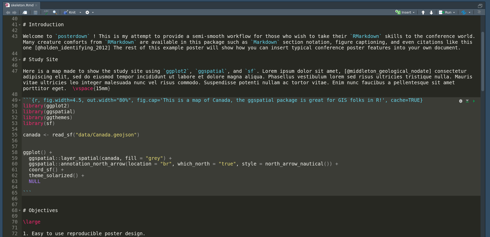
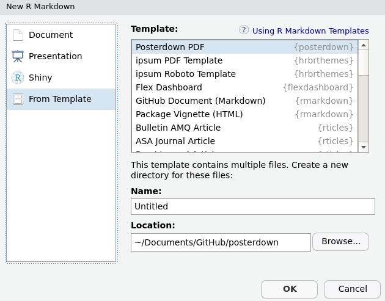

[](https://travis-ci.com/brentthorne/posterdown)

# posterdown


As a graduate student, I found that it is almost a rite of passage to take early research and analysis and generate a conference poster allowing for critical feedback. This is also important for facilitating meeting the people in your field at poster sessions at academic meetings. I have also noticed that while many of my fellow graduate students use R and are getting their feet wet with RMarkdown :blush:, we always had to go back to using MS Powerpoint or Keynote or Adobe Illustrator for generating conference posters :unamused:. Posterdown was created as a proof-of-concept (to myself) that it is possible to make a beautiful poster using open source reproducible code.

From this:



To this:


Please feel free to give me feedback or requests for changes in the [issues](https://github.com/brentthorne/posterdown/issues) page. I am currently finishing up my Master's degree so I will have limited time to work on updating this package in the next few months but nevertheless I will do what I can! :smile: 

## Installation

You can install and use **posterdown** from github using the `devtools` package as seen below.

```r

devtools::install_github("brentthorne/posterdown")

```

### Instructions if you have never used RMarkdown

1. Install `devtools` package

    ```r
    install.packages("devtools")
    ```

2. Install `posterdown` from github repo

    ```r
    devtools::install_github("brentthorne/posterdown")
    ```

3. Install `tinytex`Latex libraries:

    ```r
    tinytex::install_tinytex()
    ```

    _**NOTE** This will take some time to load the LaTex Packages but is the best option (in my opinion) for keeping your Latex library as small as possible. After the first download of these libraries you will not need to do this again. To confirm that Tinytex is properly installed use: `tinytex:::is_tinytex()` and you should get a value of `TRUE` in the console._
    
    _**NOTE** If you have conflicting versions of Latex (i.e. tinytex and MacTex), you could have problems rendering your poster. You may need to uninstall all versions, then start over by installing posterdown and tinytex from scratch._ 

## Overview

The **posterdown** package provides a familiar workflow for those used to working in [RMarkdown](https://rmarkdown.rstudio.com/). This package is currently focused on a single template called **posterdown_pdf** which is by default a 38in (H) x 45in (W) poster template but does allow for custom sizing, section headers, and colour options.

## Using posterdown from RStudio

To use **posterdown** from RStudio:

1. Install the latest [RStudio](http://www.rstudio.com/products/rstudio/download/).

2. Install the **posterdown** package: 

    ```r    
    devtools::install_github("brentthorne/posterdown")
    ```
    
3. Use the **File / New File / R Markdown.. / From Template / Posterdown PDF** dialog pathway to create a conference poster from the _Posterdown PDF_ template provided.

    

    _**NOTE** If you do not see the **Posterdown PDF** template in this dialogue box, restart the R session or close and re-open RStudio._

## Customization

Posterdown uses Latex to generate the PDF poster but more specifically it uses the [Memoir Latex](http://texdoc.net/texmf-dist/doc/latex/memoir/memman.pdf) class. Memoir was chosen for its flexibility in page sizing as well as its thorough documentation. I am fairly new to the world of Latex, and found this class to have a reasonable amount of customization available, at least for my skill level. If there are any users who think there may be better options for down the road I am more than willing to listen! 

YAML header options have been created to provide more freedom in design (i.e. colours, number of columns, and sizing) to fit a wide variety of requirements. Here are the default YAML options found in the `.Rmd` file:

### Poster Size & Default Font

|     Option    | Description |
|---------------|-------------|
| `poster_height` | Height of the final poster output. Units can be: "in", "mm", "cm" |
| `poster_width` | Width of the final poster output. Units can be: "in", "mm", "cm" |
| `font_family` | Selects the font family to be used on the poster. In the future I will try to implement multiple font families for various components of the poster (such as different fonts for the title versus the main body text).  For now, only standard Latex fonts are available, see [here](https://www.overleaf.com/learn/latex/Font_typefaces) for a list of possible options.|
| `font_size` | Represents the point value for `\normaltextsize` in latex. All other font sizes are adjusted from this baseline. For example, if the title in the skeleton document is given the Latex command `\Huge`, meaning that the title text will be "huge" relative to the `font_size` chosen. See [Here](https://www.overleaf.com/learn/latex/Font_sizes,_families,_and_styles) for a useful resource for a better understanding of the Latex text sizing options.|

### Title Box Options

#### Essential Information

|     Option    | Description |
|---------------|-------------|
| `title` | Poster title, acts as you would expect from RMarkdown. You can add line breaks in your title with \\break. |
| `author` | List of authors which (as of now) only has true support for a single author, however I have provided a hacky way to have many authors until I can find the time to figure out how to implement something like the [rticles](https://github.com/rstudio/rticles/blob/master/inst/rmarkdown/templates/mdpi_article/skeleton/skeleton.Rmd) packages does|
| `affiliation` | Author affiliations, which just as the `author` section is currently a hacky version of what I would ultimately like to produce. |

#### Style & Formatting

|     Option    | Description |
|---------------|-------------|
| `titlebox_bgcol` | Colour of the background for the Title Box area of the poster.|
| `titlebox_bordercol` | Colour of the border for the Title Box area of the poster.|
| `titlebox_shape` | Shape of the corners for the Title box (Options include: `south` or `uphill`. For all corners to be sharp use the option `"all"`. For more options please see the **[tcolorbox manual](https://mirror.hmc.edu/ctan/macros/latex/contrib/tcolorbox/tcolorbox.pdf)** and search for "sharp corners", **HINT** there are LOTS of options there :smile: . |
| `titlebox_borderwidth` | Width of the Top Title Box border. |
| `title_textcol` | Colour of the titlebox title text (AKA your title). |
| `author_textcol` | Colour of the author text. |
| `affiliation_textcol` | Colour of the affiliation text. |
| `title_textsize`| Title font size. Sizes can be one of: "tiny", "scriptsize", "footnotesize", "small", "normalsize", "large", "Large", "LARGE", "huge" or "Huge", see `font_size` above for more information.
| `author_textsize`| Author list font size
| `affiliation_textsize`| Affiliations list font size

#### Adding Logos

|     Option    | Description |
|---------------|-------------|
| `logoleft_name` | Name of the image file you want to use for the logo to the **left**. |
| `logoleft_width` | Width of the image you chose (**Note**: The height will adjust automatically based on the width to avoid distortion :smile:) |
| `logoleft_xshift` | Value to move the image along the x-axis based on the anchor being the **left** bottom corner. |
| `logoleft_yshift` | Value to move the image along the y-axis based on the anchor being the **left** bottom corner. |
| `logoright_name` | Name of the image file you want to use for the logo to the **right**. |
| `logoright_width` | Width of the image you chose (**Note**: The height will adjust automatically based on the width to avoid distortion :smile:) |
| `logoright_xshift` | Value to move the image along the x-axis based on the anchor being the **right** bottom corner. |
| `logoright_yshift` | Value to move the image along the y-axis based on the anchor being the **right** bottom corner. |

### Poster Body Options

|     Option    | Description |
|---------------|-------------|
| `body_bgcol`| Background colour of the poster's main body. |
| `body_textsize`| Font size of the poster's main paragraphs from the body. |
| `body_textcol` | Colour of the main body text. |
| `column_numbers` | Number of columns you wish for the poster to have in the main section of the poster. |
| `column_margins` | Spcaing between each column as well as the edge of the poster.|
| `columnline_col` | Colour of the line which divides each column in the poster. |
| `columnline_width` | Width of line between each column. |

#### Section Title Styling

|     Option    | Description |
|---------------|-------------|
| `sectitle_textcol` | Colour of the Section Title Text. |
| `sectitle_bgcol` | Colour of the section title box. |
| `sectitle_bordercol` | Colour of the border around the section text box. |
| `sectitle_borderwidth` | Thickness of the section title box border. |
| `sectitle_boxshape` | Shape of the corners for the section title box (Options include: `south` or `uphill`. For all corners to be sharp use the option `"all"`. For more options please see the **[tcolorbox manual](https://mirror.hmc.edu/ctan/macros/latex/contrib/tcolorbox/tcolorbox.pdf)** and search for "sharp corners", **HINT** there are LOTS of options there :smile: . |

### Bibliography Options

|     Option    | Description |
|---------------|-------------|
| `bibliography` | Name of the `.bib`. file which you are using to source material. As of right now only `biblatex` is working but I intend to add support of `natbib` which is my preference.
| `bibliography_spacing` | Sets the mutiplier for line spacing between bibliography entries, default value is `0.8`. Useful if you need to squeeze more space from somewhere.
| `bibliography_textsize`| Bibliography font size |

### Other

|     Option    | Description |
|---------------|-------------|
| `cite_col` | Colour of the citation link elements when using `biblatex`. |
| `url_col` | Colour of URL links specifically. |
| `link_col` | Colour of in-document links (example would be referencing a Figure or a Table). |
| `footnote_textcol` | Colour of the footnote text. |
| `output` | For generating `posterdown_pdf`, in the future other poster designs or templates may be made for this package and thus this option in the YAML will be more flexible. For now this is the only option. |

## Markdown Customization

As you add content to your RMarkdown file, you will notice that the output pdf will fill in columns from left to right, and from top to bottom within columns. If you have more content for your poster than available space on the default poster, it will spill onto a second page. If this occurs, you can try adding more columns and decreasing the font size (both in the YAML header) to make it work. Or, of course, edit the content to make it shorter. :smile:

## Using posterdown outside of RStudio

1. Install [pandoc](http://pandoc.org) using the [instructions for your platform](https://github.com/rstudio/rmarkdown/blob/master/PANDOC.md).

2. Install the **rmarkdown** and **posterdown** packages:

    ```r
    devtools::install_github("brentthorne/posterdown")
    ```

3. Use the `rmarkdown::draft()` function to create articles:

    ```r
    rmarkdown::draft("MyPoster.Rmd", template = "posterdown_pdf", package = "posterdown")
    ```
    
## To Do List (When Not Writing my Master's Thesis)

- [x] ~~Support for changing the size of the poster~~
- [ ] Support for Natbib
- [ ] Support for nbib from PubMed
- [x] ~~Support for logo placement in the title bar section of poster~~ :tada:
- [ ] Gradient colour options
- [ ] True YAML multi-author/ multi-affiliation support
- [x] Toggle citation section on/off as per user's choice (**KIND OF DONE BUT NEEDS WORK**)
- [x] ~~Make colour options standardized (probably hex colours if possible)~~
- [ ] Allow users to choose colour options from a palette??
- [x] ~~Fill/style Section headings if user wishes~~
