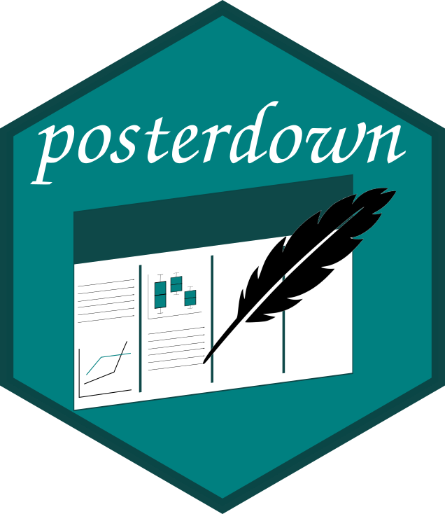
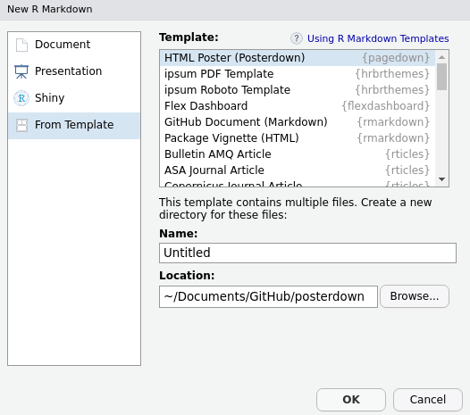

[](https://travis-ci.com/brentthorne/posterdown)

# posterdown



**Support**

_Please consider supporting posterdown on [Patreon](https://www.patreon.com/brentthorne) to ensure continued support and development for this package, as (grad school + open source developer != :dollar:) ._

_**You can also support via cyrptocurrencies at:**_

_**Bitcoin**: 1KZ3zyNsxdR8NjYL9vomb9fmpkXSXvK5VR <br>_
_**Ethereum**: 0x71a18c5E3300a33F1139a9eA0abc0D029E3C30F7 <br>_
_**Litecoin**: LR4usZRgjJGLAg3Tu5PSBjgUaVtdts9Wnw <br>_

_You can also follow me (Brent Thorne) on [twitter](twitter.com/brentthorne18) for upcoming features which may not be released on github._

#

As a graduate student, I found that it is almost a rite of passage to take early research and analysis and generate a conference poster allowing for critical feedback. This is also important for facilitating meeting the people in your field at poster sessions at academic meetings. I have also noticed that while many of my fellow graduate students use R and are getting their feet wet with RMarkdown :blush:, we always had to go back to using MS Powerpoint or Keynote or Adobe Illustrator for generating conference posters :unamused:. Posterdown was created as a proof-of-concept (to myself) that it is possible to make a beautiful poster using open source reproducible code.

From this:


To this:

[](https://brentthorne.github.io/posterdown_html_showcase/)

**NEW OPTION:**

[](https://twitter.com/brentthorne18/status/1115096932068790272)

Please feel free to give me feedback or requests for changes in the [issues](https://github.com/brentthorne/posterdown/issues) page. I am currently finishing up my Master's degree so I will have limited time to work on updating this package in the next few months but, nevertheless, I will do what I can! :smile: 

#### Citation

To cite `posterdown` in publications, use:

`W. Brent Thorne (2019). posterdown: An R Package Built to Generate Reproducible Conference Posters for the Academic and Professional World Were Powerpoint and Pages Just Wont Cut It. R package version 0.1.2.`

A BibTeX entry for LaTeX users is:

```
  @Manual{posterdown,
    title = {posterdown: An R Package Built to Generate Reproducible Conference Posters for the Academic and Professional World Were Powerpoint and Pages Just Wont Cut It},
    author = {W. Brent Thorne},
    year = {2019},
    url = {https://github.com/brentthorne/posterdown},
    note = {R package version 0.1.2},
  }
```
## Installation

You can install and use **posterdown** from github using the `devtools` package as seen below.

> **NOTE on posterdown_html():**  This requires a recent version of Pandoc (>= 2.2.3). If you use RStudio, you are recommended to install the [Preview version](https://www.rstudio.com/products/rstudio/download/preview/) (>= 1.2.1070), which has bundled Pandoc 2.x, otherwise you need to install Pandoc separately.

```r

devtools::install_github("brentthorne/posterdown")

```

### Instructions if you have never used RMarkdown

#### For HTML and LaTeX

1. Install `devtools` package

```r
install.packages("devtools")
```

2. Install `posterdown` from github repo

```r
devtools::install_github("brentthorne/posterdown")
```
#### LaTeX Only

3. Install `tinytex`Latex libraries:

```r
tinytex::install_tinytex()
```

 > _**NOTE:** This will take some time to load the LaTex Packages but is the best option (in my opinion) for keeping your Latex library as small as possible. After the first download of these libraries you will not need to do this again. To confirm that Tinytex is properly installed use: `tinytex:::is_tinytex()` and you should get a value of `TRUE` in the console._
    
>_**NOTE:** If you have conflicting versions of Latex (i.e. tinytex and MacTex), you could have problems rendering your poster. You may need to uninstall all versions, then start over by installing posterdown and tinytex from scratch._ 

## Overview

The **posterdown** package provides a familiar workflow for those used to working in [RMarkdown](https://rmarkdown.rstudio.com/). This package has two templates **`posterdown_latex`** and **`posterdown_html`**. 

### HTML

**`posterdown_betterland`** uses the [#betterposter](https://twitter.com/mikemorrison/status/1110191245035479041) design to layout your poster in a new and exciting way. Stand out from the crowd and encourage meaningful discussion with your work! More to come on this poster desing and how to use is soon!

**`posterdown_betterport`** uses the portrait version of the [#betterposter](https://twitter.com/mikemorrison/status/1110191245035479041) design.

**`posterdown_html`** utilizes the wonderful work being done by @RLesur and @yihui on [pagedown](github.com/rstudio/pagedown). This method allows for some cool features like the ability to run an html wiget (aka shiny app or a leaflet map) live in the poster (unless you print it obviously). It even allows for integration with one of my favourite R packages [gganimate](github.com/thomasp85/gganimate). 

Behind the scenes is the `template.html` file which contains both the `html` and `css` code. If you are interested in building your own template I reccommened checking out this great resource from [bookdown](https://bookdown.org/yihui/bookdown/templates.html).

### LaTeX

**`posterdown_latex`** (formerly `posterdown_pdf`) uses LaTeX to generate the PDF posters, more specifically it uses the [Memoir Latex](http://texdoc.net/texmf-dist/doc/latex/memoir/memman.pdf) class. Memoir was chosen for its flexibility in page sizing as well as its thorough documentation. I am fairly new to the world of Latex, and found this class to have a reasonable amount of customization available, at least for my skill level. If there are any users who think there may be better options for down the road I am more than willing to listen!

## Using posterdown from RStudio

To use **posterdown** from RStudio:

1. Install the latest [RStudio](http://www.rstudio.com/products/rstudio/download/).

2. Install the **posterdown** package: 

```r
devtools::install_github("brentthorne/posterdown")
```
    
3. Use the **File / New File / R Markdown.. / From Template / Posterdown HTML**  or **Posterdown LaTeX** dialog pathway to create a conference poster.

    

>   _**NOTE:** If you do not see the **Posterdown HTML** or **Posterdown LaTeX** templates in this dialogue box, restart the R session or close and re-open RStudio._

## Using posterdown outside of RStudio

1. Install [pandoc](http://pandoc.org) using the [instructions for your platform](https://github.com/rstudio/rmarkdown/blob/master/PANDOC.md).

2. Install the **rmarkdown** and **posterdown** packages:

```r
devtools::install_github("brentthorne/posterdown")
```

3. Use the `rmarkdown::draft()` function to create articles:

```r
rmarkdown::draft("MyPoster.Rmd", template = "posterdown_html", package = "posterdown")
```

## Customization

YAML header options have been created to provide more freedom in design (i.e. colours, number of columns, and sizing) to fit a wide variety of requirements. Here are the default YAML options found in the `.Rmd` file:

### Poster Size & Default Font

|     Option    | Compatability | Description |
|:---------------:|:--------------------:|-----------------|
| `poster_height` | HTML, LaTeX | Height of the final poster output. Units can be: "in", "mm", "cm" |
| `poster_width` | HTML, LaTeX |  Width of the final poster output. Units can be: "in", "mm", "cm" |
| `font_family` | HTML, LaTeX |  Selects the font family to be used on the poster. <br><br> **HTML:** This applies to the entire document, however you can easily change individual fonts, see **`titletext_fontfamily`** <br><br> **LaTeX:** In the future I will try to implement multiple font families for various components of the poster (such as different fonts for the title versus the main body text).  For now, only standard Latex fonts are available, see [here](https://www.overleaf.com/learn/latex/Font_typefaces) for a list of possible options.|
| `font_size` | LaTeX |  Represents the point value for `\normaltextsize` in latex. All other font sizes are adjusted from this baseline. For example, if the title in the skeleton document is given the Latex command `\Huge`, meaning that the title text will be "huge" relative to the `font_size` chosen. See [Here](https://www.overleaf.com/learn/latex/Font_sizes,_families,_and_styles) for a useful resource for a better understanding of the Latex text sizing options. See **`body_textsize`** for **HTML** equivalent. |

### Title Box Options

#### Essential Information

|     Option    | Compatability | Description |
|:--------------:|:-:|------------|
| `title` | HTML, LaTeX | Poster title, acts as you would expect from RMarkdown.<br><br> **HTML:** You can add line breaks in your title with `<br>`  <br><br> **LaTeX:** You can add line breaks in your title with `\break`. |
| `author` | HTML, LaTeX | List of authors. <br><br> **HTML:** Supports listing authors, will soon add support for linked affiliations. <br><br> **LaTeX:** as of now only has true support for a single author, however I have provided a hacky way to have many authors until I can find the time to figure out how to implement something like the [rticles](https://github.com/rstudio/rticles/blob/master/inst/rmarkdown/templates/mdpi_article/skeleton/skeleton.Rmd) packages does|
| `affiliation` | HTML, LaTeX | Author affiliations, which just as the `author` section is currently a hacky version of what I would ultimately like to produce. |

#### Style & Formatting

|     Option    | Compatability | Description |
|:--------------:|:-:|------------|
| `titlebox_bgcol` | HTML, LaTeX | Colour of the background for the Title Box area of the poster.|
| `titlebox_bordercol` | HTML, LaTeX | Colour of the border for the Title Box area of the poster.|
| `titlebox_shape` | LaTeX | Shape of the corners for the Title box (Options include: `south` or `uphill`. For all corners to be sharp use the option `"all"`. For more options please see the **[tcolorbox manual](https://mirror.hmc.edu/ctan/macros/latex/contrib/tcolorbox/tcolorbox.pdf)** and search for "sharp corners", **HINT** there are LOTS of options there :smile: . |
| `titlebox_borderwidth` | HTML, LaTeX | Width of the Top Title Box border. |
| `title_textcol` | HTML, LaTeX | Colour of the titlebox title text (AKA your title). |
| `author_textcol` | HTML, LaTeX | Colour of the author text. |
| `affiliation_textcol` | HTML, LaTeX | Colour of the affiliation text. |
| `title_textsize`| HTML, LaTeX | Title font size. <br><br> **HTML:** You can use specific sizes, see this [link](https://www.w3schools.com/cssref/pr_font_font-size.asp) for more on text sizes in html/css. <br><br> **LaTeX:** Sizes can be one of: "tiny", "scriptsize", "footnotesize", "small", "normalsize", "large", "Large", "LARGE", "huge" or "Huge", see `font_size` above for more information.
| `author_textsize`|  HTML, LaTeX | Author list font size
| `affiliation_textsize`| HTML, LaTeX | Affiliations list font size

#### Adding Logos

|     Option    | Compatability | Description |
|:--------------:|:-:|------------|
| `logoleft_name` | HTML, LaTeX | Name of the image file you want to use for the logo to the **left**. |
| `logoleft_width` |  LaTeX |Width of the image you chose (**Note**: The height will adjust automatically based on the width to avoid distortion :smile:) |
| `logoleft_xshift` |  LaTeX | Value to move the image along the x-axis based on the anchor being the **left** bottom corner. |
| `logoleft_yshift` | LaTeX | Value to move the image along the y-axis based on the anchor being the **left** bottom corner. |
| `logoright_name` | HTML, LaTeX | Name of the image file you want to use for the logo to the **right**. |
| `logoright_width` | LaTeX | Width of the image you chose (**Note**: The height will adjust automatically based on the width to avoid distortion :smile:) |
| `logoright_xshift` | LaTeX | Value to move the image along the x-axis based on the anchor being the **right** bottom corner. |
| `logoright_yshift` | LaTeX | Value to move the image along the y-axis based on the anchor being the **right** bottom corner. |

### Poster Body Options

|     Option    | Compatability | Description |
|:--------------:|:-:|------------|
| `body_bgcol`| HTML, LaTeX | Background colour of the poster's main body. |
| `body_textsize`| HTML, LaTeX | Font size of the poster's main paragraphs from the body. <br><br> **HTML:** You can use specific sizes, see this [link](https://www.w3schools.com/cssref/pr_font_font-size.asp) for more on text sizes in html/css. <br><br> **LaTeX:** Sizes can be one of: "tiny", "scriptsize", "footnotesize", "small", "normalsize", "large", "Large", "LARGE", "huge" or "Huge", see `font_size` above for more information.  |
| `body_textcol` | HTML, LaTeX | Colour of the main body text. |
| `column_numbers` |  HTML, LaTeX | Number of columns you wish for the poster to have in the main section of the poster. |
| `column_margins` | HTML, LaTeX | Spcaing between each column as well as the edge of the poster.|
| `columnline_col` | HTML, LaTeX | Colour of the line which divides each column in the poster. |
| `columnline_width` | HTML, LaTeX | Width of line between each column. |
| `columnline_style` | HTML | Choose from: `solid`, `dashed`, `dotted` etc. See more [here](https://www.w3schools.com/css/css_border.asp).

#### Section Title Styling

|     Option    | Compatability | Description |
|:--------------:|:-:|------------|
| `sectitle_textcol` | HTML, LaTeX | Colour of the Section Title Text. |
| `sectitle_bgcol` | HTML, LaTeX | Colour of the section title box. |
| `sectitle_bordercol` | HTML, LaTeX | Colour of the border around the section text box. |
| `sectitle_borderwidth` | HTML, LaTeX | Thickness of the section title box border. |
| `sectitle_boxshape` | HTML, LaTeX | Shape of the corners for the section title box. <br><br> **HTML:** Can be a single value such as `4mm` which will apply rounding to all corners, up to 4 values which will change the roundness for each corner individually. See [this](https://www.w3schools.com/css/css3_borders.asp) for more help.  <br><br> **LaTeX:** Options such as `south` or `uphill`. For all corners to be sharp use the option `"all"`. For more options please see the [tcolorbox manual](https://mirror.hmc.edu/ctan/macros/latex/contrib/tcolorbox/tcolorbox.pdf) and search for "sharp corners", **HINT** there are LOTS of options there :smile: . |

### Bibliography Options

|     Option    | Compatability | Description |
|:--------------:|:-:|------------|
| `bibliography` | HTML, LaTeX | Name of the `.bib`. file which you are using to source material. <br><br> **HTML:** Use this as you would in a typical RMarkdown document. You can also use a custom `csl` file. See the Rmarkdown examples [here](https://rmarkdown.rstudio.com/authoring_bibliographies_and_citations.html).  <br><br> **LaTeX:** As of right now only `biblatex` is working but I intend to add support for `natbib` which is my preference.
| `bibliography_spacing` | LaTeX | Sets the mutiplier for line spacing between bibliography entries, default value is `0.8`. Useful if you need to squeeze more space from somewhere.
| `bibliography_textsize`| HTML, LaTeX | Bibliography font size |

### Other

|     Option    | Compatability | Description |
|:--------------:|:-:|------------|
| `cite_col` | LaTeX | Colour of the citation link elements when using `biblatex`. |
| `url_col` | LaTeX | Colour of URL links specifically. |
| `link_col` | HTML, LaTeX | Colour of in-document links (example would be referencing a Figure or a Table). |
| `footnote_textcol` | LaTeX | Colour of the footnote text. |
| `header-includes` | LaTeX | (Optional) Content to include in the header, provided as a one line command or a YAML list with one command per line. For example, to use a sans-serif font as the default font: `header-includes: \renewcommand{\familydefault}{\sfdefault}`.|
| `output` | HTML, LaTeX | For generating `posterdown_html` or `posterdown_latex`, in the future other poster designs or templates may be made for this package and thus this option in the YAML will be more flexible. `posterdown_pdf` will be kept for legacy use but will not be updated, new projects which would have used it should now use `posterdown_latex`.|

## Markdown Customization

As you add content to your RMarkdown file, you will notice that the output pdf will fill in columns from left to right, and from top to bottom within columns. If you have more content for your poster than available space on the default poster, it will spill onto a second page. If this occurs, you can try adding more columns and decreasing the font size (both in the YAML header) to make it work. Or, of course, edit the content to make it shorter. :smile:

## To Do List (When Not Writing my Master's Thesis)

1. posterdown_html()

	- [ ] Better citation support
	- [ ] Provide colour pallete options for the people who don't want to change every single individual colour in the poster.

2. posterdown_latex()

	- [x] ~~Support for changing the size of the poster~~
	- [ ] Support for Natbib
	- [ ] Support for nbib from PubMed
	- [x] ~~Support for logo placement in the title bar section of poster~~ :tada:
	- [ ] Gradient colour options
	- [ ] True YAML multi-author/ multi-affiliation support
	- [x] Toggle citation section on/off as per user's choice (**KIND OF DONE BUT NEEDS WORK**)
	- [x] ~~Make colour options standardized (probably hex colours if possible)~~
	- [ ] Allow users to choose colour options from a palette??
	- [x] ~~Fill/style Section headings if user wishes~~

3. Other
	- [ ] Make a showcase of awesome posters made from `posterdown` :smile:.
	- [ ] Make a video series similar to [GeomaTECHs](https://www.youtube.com/channel/UCTalI0S14Ek6DcvvvFIFPOg) for tutorial on this package.


