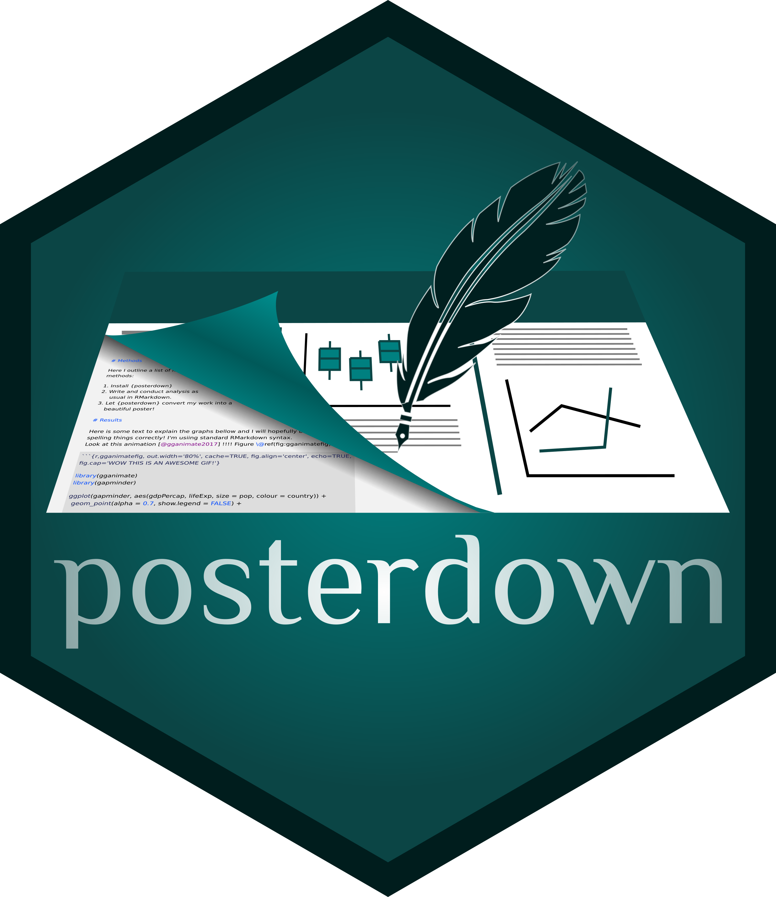

# posterdown

<!-- badges: start -->
[](https://www.tidyverse.org/lifecycle/#maturing)
[](https://travis-ci.com/brentthorne/posterdown)
[](https://CRAN.R-project.org/package=posterdown) [](https://CRAN.R-project.org/package=posterdown)
<!-- badges: end -->

As a graduate student, I found that it is almost a rite of passage to take early research and analysis and generate a conference poster allowing for critical feedback. This is also important for facilitating meeting the people in your field at poster sessions at academic meetings. I have also noticed that while many of my fellow graduate students use R and are getting their feet wet with RMarkdown :blush:, we always had to go back to using MS Powerpoint or Keynote or Adobe Illustrator for generating conference posters :unamused:. Posterdown was created as a proof-of-concept (to myself) that it is possible to make a beautiful poster using open source reproducible code.

|   Quick Links  |
|:-------|
| [**Current Template Styles**](https://github.com/brentthorne/posterdown#current-template-styles) |
| [**Getting Started**](https://github.com/brentthorne/posterdown#getting-started) |
| [**Support**](https://github.com/brentthorne/posterdown#support) |
| [**Wiki**](https://github.com/brentthorne/posterdown/wiki) |
| [**Showcase**](https://github.com/brentthorne/posterdown/wiki/Showcase) |

## Current Template Styles

| `posterdown_html` | `posterdown_betterland` | `posterdown_betterport` |
|:---------------:|:---------------------:|:---------------------:|
|[](https://brentthorne.github.io/posterdown_html_showcase/) |  |  |

## Getting Started

> ~~Until the first release of posterdown occurs on CRAN please fork this repo and use your version to ensure stability while building your poster. Changes made here can be sporadic but also tend to be drastic. Otherwise, use this repo at your own discression! :trollface:~~

> posterdown v1.0 is now on [CRAN](https://cran.r-project.org/web/packages/posterdown/index.html) !! :smile:

To install from CRAN use `install.packages("posterdown")`.

To install from github use `remotes::install_github("brentthorne/posterdown")`. 

Now add this to the YAML options of your rmarkdown (.Rmd) file:

```markdown
---
output: 
  posterdown::posterdown_html
---
```

For further customization options please see the (currently in progress :hammer:) [wiki](https://github.com/brentthorne/posterdown/wiki)

## Support

_Please consider supporting posterdown to ensure continued support and development for this package, as **grad school + open source developer != :dollar:.**_

**[Patreon](https://www.patreon.com/brentthorne)** - Monthly<br>
**[PayPal](https://paypal.me/brentthorne)** - Single Payment<br>
**Bitcoin**: `1KZ3zyNsxdR8NjYL9vomb9fmpkXSXvK5VR`<br>
**Ethereum**: `0x71a18c5E3300a33F1139a9eA0abc0D029E3C30F7`<br>
 **Litecoin**: `LR4usZRgjJGLAg3Tu5PSBjgUaVtdts9Wnw`

_You can also follow me (Brent Thorne) on [twitter](https://twitter.com/wbrentthorne) for upcoming features which may not be released on github._

Please feel free to give me feedback or requests for changes in the [issues](https://github.com/brentthorne/posterdown/issues) page. I am currently finishing up my Master's degree so I will have limited time to work on updating this package in the next few months but, nevertheless, I will do what I can! :smile: 
